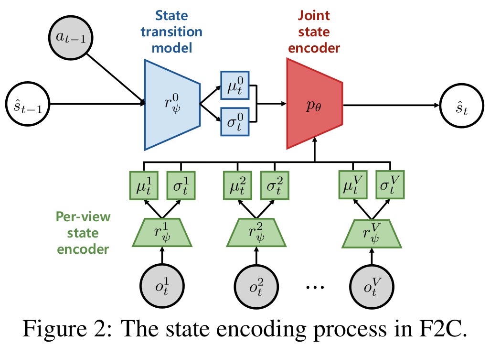

# Fuse2Control (F2C)
<p align="center">

</p>
Implementation of our work 'Information-Theoretic State Space Model for Multi-View Reinforcement Learning' accepted at ICML 2023.

### 1. Prerequisites

Install following libraries and packages in a conda environment:

```
conda create -n fuse2control python=3.7.5
conda activate fuse2control
conda install pytorch==1.6.0 torchvision==0.7.0 cudatoolkit=10.2 -c pytorch
pip3 install -r requirements.txt
pip install Box2D sklearn wget
```

### 2. Train & evaluate MVSSM and baseline algorithms
We provide algorithms included in the paper, e.g. `MVSSM` (ours), `MVTCAE`, `SLAC`, `CMC` or `Vanilla-RL`.
Experiments can be started by running `main.py` as follows:

```bash
python main.py --method=$METHOD --missing_view_num=$MISSING_VIEW_NUM --seed=$SEED --use_collected_data=$USE_COLLECTED_DATA
```
- To choose among running the MVSSM, MVTCAE, SLAC, CMC and Vanilla-RL, you need to set the value of variable `$METHOD` to `MVSSM`, `MVTCAE`, `SLAC`, `CMC` or `Vanilla-RL` respectively.
- To choose the number of missing views, you need to change the value of variable `$MISSING_VIEW_NUM` to `0`, `1`, `2`, `3` or `4` respectively.
- To choose the random seed, you need to change the value of variable `$SEED` to `0`, `1`, `2`, `3` or `4` respectively.
- To collect dataset on your own (instead of using pre-collected dataset), you need to change the value of variable `$USE_COLLECTED_DATA` to `False`.

(Example)
```bash
python main.py --method=MVSSM --missing_view_num=0 --seed=0 --use_collected_data=True
```

### 3. Results
<p align="center">

</p>


### Notes
We used 40 CPU instances (n1-highcpu-32) from Google Cloud Platform(GCP).

All the numbers are averaged over 5 different seeds (0~4).

We appreciate [PPO-PyTorch](https://github.com/nikhilbarhate99/PPO-PyTorch) which our implementation is heavily based on.
